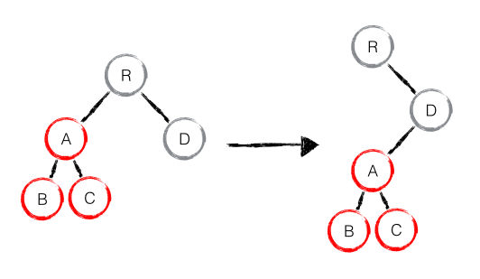
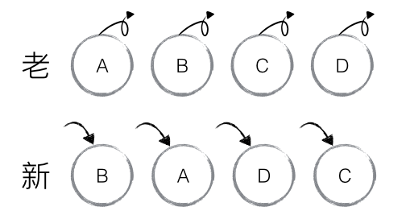

# vdom
## 解决的3个问题
- 高效的diff算法
- 只更新需要更新的dom节点
- 数据变化监测，batch dom读写操作

### diff算法
- 递归 O(n^3)
- react vdom diff O(n)
    - 很少跨层，所以就同层比较，不跨层比较 -- tree diff
    - 相同 component 有相同 tree 结构，不同 component 有不同 tree 结构 -- component diff
    - 同一层级的子节点 ，key唯一 -- element diff

### 1.tree diff
#### 如果有跨层级移动，应该如何处理

createA -> createB -> createC -> deleteA

### 2.component diff

- 相同 component -> tree diff
- 不同 component(dirty commponent) 替换所有子节点
- shouldComponentUpdate()

deleteD -> createE -> createF

### 3.element diff
- insert_markup
- move_existing
- delete_node

## **key**的作用

## 总结
- O(n^3) => O(n)
- 分层比较 tree diff
- component diff
- 设置 key，element diff
- 建议：保持 dom 结构稳定 提升性能
- 建议：避免直接将行尾的元素插到最前面
- shouldComponentUpdate()